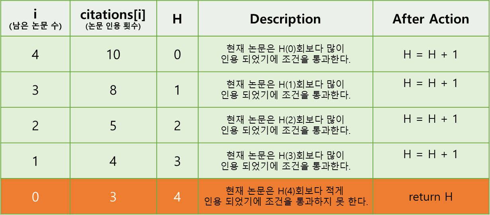

# H-Index 문제 풀이

> H-Index 계산 방식 (위키 기준)   
> 논문의 갯수가 N개 있다고 할 때, 다음 조건에 맞는 최대값을 H-Index라 한다.    
> 인용횟수를 X라 할 때, X < X번 이하 인용된 논문의 수 조건과   
> X > X번 이하 인용된 논문 수 조건이 모두 만족해야 한다.   
> Ex: f(A)=10, f(B)=8, f(C)=5, f(D)=4, f(E)=3 → h-index=4

> 프로그래머스내 H-INDEX 계산 방식 설명   
> 어떤 과학자가 발표한 논문 n편 중, h번 이상 인용된 논문이 h편 이상이고  
> 나머지 논문이 h번 이하 인용되었다면 h의 최댓값이 이 과학자의 H-Index입니다.

## 1. 반복문을 이용한 방식
```java
public class Solution {
    public int solution(int[] citations) {
        int h = 0;
        Arrays.sort(citations);

        for (int i = citations.length - 1; i >= 0; i--, h++) {
            if (h >= citations[i]) {
                return h;
            }
        }
        return h;
    }
}
```
- Arrays.sort는 오름차순정렬이기 때문에 반복문은 마지막 인덱스에서부터 최초 인덱스까지 순회하는 방식으로 구현한다. 
- 현재 `바라보는 논문의 인용 횟수(citaions[i])`와 `조건이 통과된 눈문 수(h)`를 비교한다.
  - `바라보는 논문의 인용 횟수(citaions[i])`가 작은 경우 그 다음 논문들도 인용횟수가 모두 현재 `통과된 논문 수(h)`보다 작기 때문에 반복할 필요가 없다. 
- 반복문이 다 돌 때까지 `통과된 논문 수(h)`가 각 `논문의 인용 횟수(citations[i])`보다 작을 경우 해당 논문의 갯수가 `h-index`가 된다.

### ✈ f(A)=10, f(B)=8, f(C)=5, f(D)=4, f(E)=3인 경우 H-INDEX 를 구하는 과정 표

- 남은 논문의 수가 0개인 시점에서 h(4)번 이상 인용된 논문이 h(4)편이다.
- 현재 논문이 인용된 횟수(citations[i])는 3회로 현재 h보다 작기에 h(4)를 반환한다.
- 즉, 5개의 논문 중 4회이상 인용된 논문의 숫자가 4개이기에 4를 반환한다.


## 2. 재귀 함수를 이용한 방식
```java
public class Solution {
    public int solution(int[] citations) {
        Arrays.sort(citations);
        return recSolution(citations, citations.length - 1, 0);
    }

    private int recSolution(int[] citations, int numOfRemainCitation, int h) {
        if (numOfRemainCitation < 0 || h >= citations[numOfRemainCitation]) {
            return h;
        }

        return recSolution(citations, numOfRemainCitation - 1, h + 1);
    }
}
```
